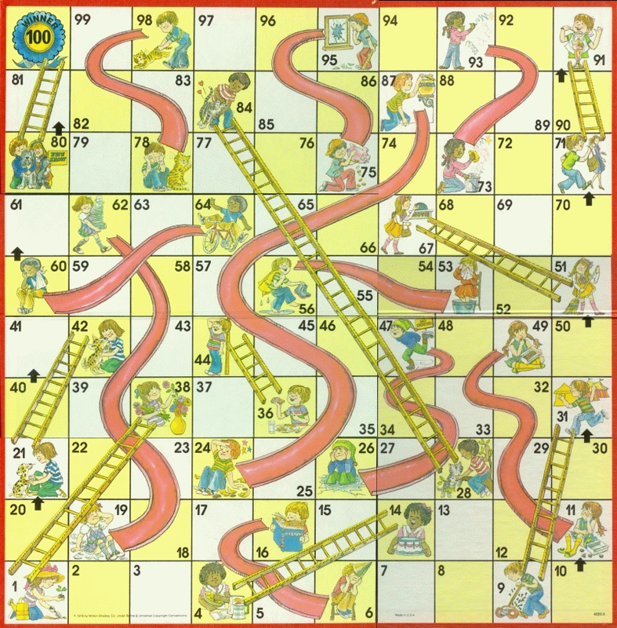

# CS216 – Software Development

**Programming Assignment P3 Chutes and Ladders Functions and Branching**  
**30 points**  
**Due: 5:00 pm, Wednesday, February 4, 2026** 

---
## Overview

The purpose of this assignment is to utilize functions, individual IF statements, and nested IF statements
to create a four-player **Chutes and Ladders game**.




## Requirements and Grading

Use the [`p3.py`](p3.py) template code shown below

Begin by updating the functions to play a two person game.  Note: ***Do not modify the processTurn function***

1. (1 point) Update `getSpin` function to return a random number between 1 and 6

2. (1 points) Update `gameWon( N )` function to use **if with else** approach to return True of N is 100 otherwise false

3. (1 points) Update `offBoard( N )` function to use an **if with else** approach to return True if N is not between 1 and 100 and False otherwise

4. (5 points) Update `isLadder( N )` function to use **individual if approach** (ie. no else or elif) to 
return True if N is bottom ladder position and False if it is not

5. (5 points) Update `isChute( N )` function to use **individual if approach** (ie. no else or elif) to 
return True if N is top ladder position and False if it is not

6. (5 points) Update `upLadder( N )` function to use **nested elif approach** to return top of ladder position given bottom position N
7. (5 points) Update `downChute( N )` function to use **nested elif approach** to return bottom of chute position given top position N
    
8. (3 points) Update the main logic to create a **four-player game**. Do not modify any functions to make this change rather use the 
functions you have already created and utilized for the two-person game. Use the approach shown ie. copy and paste
code for getting player names and processing turn.

9. (1 points) Add comments at throughout your code including at least one comment per function. Update top comment block with your name and date

10. (3 points) Run the `p3_test.py` code to test your functions.  Add sample test cases for testing your `downChute(N)` function.


---


## p3.py template code

```python
import random

# p3.py
# spring 2026
# your name
# 
# Chutes and Ladders
# 1. Begin by updating the functions to play a two person game
#    Do not modify the processTurn function
#
# 2. Update the main logic to create a four player game
#    Do not modify your functions to make this change

def getSpin():
    """ return random int 1 to 6 """
    return random.randint(1,3)

def offBoard( N ):
    """ use an IF statement approach to return True if N is not between 1 and 100 """
    return False

def gameWon( N ):
    """ use if statements to return True of N is 100 """
    result = False
    if N >= 30:
        result = True
    return result

def isLadder( N ):
    """ use individual if approach (ie. no else or elif) to return True if N is bottom ladder position """
    result = False
    if N == 4:
        result = True
    return result

def isChute( N ):
    """ use individual if approach (ie. no else or elif) to return True if N is top of chute position """
    result = False
    if N == 16:
        result = True
    return result
  
def upLadder( N ):
    """ use nested elif approach to return top of ladder position from bottom position N """
    result = -1
    if N == 4:
        result = 14
            
    return result
    
def downChute( N ):
    """ use nested elif approch to return bottom of chute position from top position N """
    result = -1
    if N == 16:
        result = 6
    return result


# *** do not modify processTurn **
def processTurn( player, position ):
    
    spin = getSpin()
    
    print(f"{player} Spin = {spin}".format(player, spin))
    
    nextPosition = position + spin
    
    if isLadder( nextPosition ) == True:
        endingPosition = upLadder( nextPosition )
        print( f"{player} Up ladder at {nextPosition} to {endingPosition}".format( player, nextPosition, endingPosition ) )            
        position = endingPosition

    elif isChute( nextPosition ) == True:
        endingPosition = downChute( nextPosition )
        print( f"{player} Down chute at {nextPosition} to {endingPosition}" )            
        position = endingPosition
    
    elif offBoard( nextPosition ) == True:
        print( " Off board, try again ..." )
               
    else:
        print( f"{player} Move to {nextPosition}" )
        position = nextPosition
    
    if gameWon(position):
        print()
        print( f"Game Over ... {player} Wins!!!" )

    return position


# *** main game logic ***
if __name__ == "__main__":

    #random.seed( -1 () #can set number to get same random numbers
        
    print( "Enter player 1 name: " )
    #player1 = input() #comment out when debugging
    player1 = "Alice"  #comment out when submitting
    
    print( "Enter player 2 name: " )
    #player2 = input() #comment out when debugging
    player2 = "Bob"  #comment out when submitting
    
    print()
    
    player1Position = 0
    player2Position = 0
    
    gameOver = False
    while gameOver != True:
        
        player1Position = processTurn( player1, player1Position )
        gameOver = gameWon( player1Position )
        
        if gameOver != True:
            player2Position = processTurn( player2, player2Position )
            gameOver = gameWon( player2Position )
     
        #while loop

            
               
```

---

## Submitting Your Assignment

Submit **both files**:

* `p3.py`
* `p3_test.py` (with your added tests for downChute function)

### Submission Steps

1. Host both files in a GitHub repository
2. Upload the GitHub link(or links) in Moodle


-— end —-

