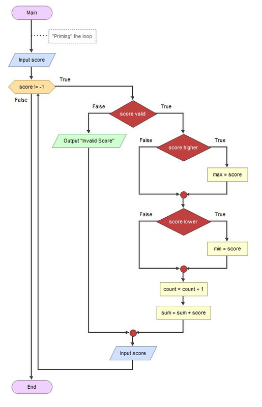

# CS216 – Software Development

**Programming Assignment CS 216 P4 – Bowling Scores**  
**30 points**  
**Due: 5:00 pm, Wednesday, February 18, 2026** 

---

## Requirements

The local Bowling Center holds a tournament each week. Bowlers from the community bowl a single game and report their scores.

Write a Python program that will input bowling scores (0 to 300) until the value `-1` is entered.

Your program may use concepts including:

* Variables
* `if` statements
* Loops

You **may not** use advanced data structures such as:

* Lists
* Dictionaries
* Files
* Any other advanced data structures

---

## Input Requirements

The program must display the current score number as part of the input prompt:

```
Enter score 1 (-1 to quit):
Enter score 2 (-1 to quit):
Enter score 3 (-1 to quit):
```

### Example Input Session

```
Enter score 1 (-1 to quit):
127
Enter score 2 (-1 to quit):
213
Enter score 3 (-1 to quit):
146
```

If an invalid value is entered, display the following message and allow the score to be re-entered:

```
Error: Invalid score, Expecting 0-300
```

### Example of Invalid Entry

```
Enter score 4 (-1 to quit):
307
Error: Invalid score, Expecting 0-300
Enter score 4 (-1 to quit):
256
```

---

## Program Output

When `-1` is entered, your program must display:

* Number of bowlers
* High score
* Low score
* Average score

The average score must be formatted to **two decimal places**.

### Example Final Output

```
Enter score 5 (-1 to quit):
-1

Number of Bowlers: 4
High Score: 256
Low Score: 127
Avg Score: 185.50
```

---

## Additional Requirements

* Update the comments in your program with:

  * Your name
  * The current date

---

## Loop Logic Requirement

Use the loop logic shown in the provided sample flowchart.

This approach:

* Uses the **priming the loop** model
* Avoids the use of `break` or `continue` statements

Refer to:



---
## Starting Code

```python
# ** add program name here **
# ** add your name here **
# **add date here **
# sentinel-controlled loop to determine high, low, average
# bowling scores

min = 301
max = -1
numberBowlers = 0
totalScore = 0

# Processing using Sentinel loop

# ** add your code here **

    
# Output
print()
print(f"Number of Bowlers: {numberBowlers}")
print(f"High Score: {max}")
print(f"Low Score: {min}")
print(f"Avg Score: {avg:.1f}")
```
---

**End of Requirements**
