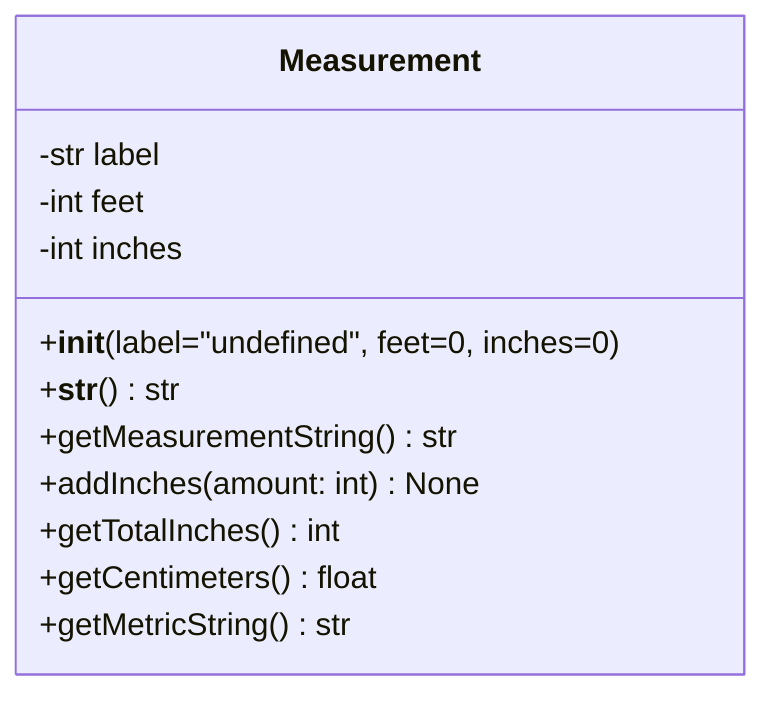

# CS216 – Software Development

**P9 Assignment: Measurement Class with Tkinter GUI**  
**60 points**  
**Due: 5:00 pm, April 24, 2026**


---
## Overview

In this assignment, you will create and test a Python class called `Measurement` that stores a measurement using **feet** and **inches**. After testing your class in a regular Python program, you will use that class in a basic **Tkinter GUI**.

This assignment is designed to help you practice:

* creating classes and objects
* writing constructors and methods
* returning values from methods
* formatting output
* create a basic GUI using Tkinter
* using a class inside a GUI program

---

# Part 1 – Create and Test the Measurement Class

Create a class called `Measurement` with the attributes and methods described below.  

Use the file name `Measurement.py`

## UML Diagram


---
##

Use following file format for `Measurement.py`

``` python
class Measurement:
    # *** add code here


    #end class
    
    
if __name__ == "__main__":

    # *** add code here ***
```

---

## Step 1 – Add a Constructor

Add a constructor to initialize a `Measurement` object.

### Requirements

The constructor must:

* take `label`, `feet`, and `inches` as arguments
* store those values in the instance variables:

  * `self.label`
  * `self.feet`
  * `self.inches`

### Default Values

If no arguments are passed, the constructor must set:

* `label` to `"undefined"`
* `feet` to `0`
* `inches` to `0`

---

## Step 2 – Create and Test a Default Object 

Create an instance called `office` using the default constructor.

Add the following code to your test section:

```python
office = Measurement()

print(office.label)
print(office.feet)
print(office.inches)
print()
```

---

## Step 3 – Modify the Office Measurement 

Change the values for the `office` object so that:

* label = `"SH 186"`
* feet = `15`
* inches = `3`

Then print the updated values.

Add code such as:

```python
# add code here to change office label, feet, and inches

print(office.label)
print(office.feet)
print(office.inches)
print()
```

---

## Step 4 – Create and Print Another Measurement 

Create an instance called `alice` with the following values:

* label = `"Center Alice #16"`
* feet = `5`
* inches = `9`

Add the following code and print the label, feet, and inches for `alice`, each on a separate line.

```python
alice = Measurement("Center Alice #16", 5, 9)

# add code to print label, feet, and inches for alice,
# each on a separate line

print()
```

---

## Step 5 – Add a `getMeasurementString()` Method 

Add a method called `getMeasurementString()` that returns the measurement in this format:

```text
5' 9"
```

### Test your method

Add code such as:

```python
print(alice.getMeasurementString())
print()
```

---

## Step 6 – Override the `__str__()` Method

Override the `__str__()` method so that printing a `Measurement` object returns the label and measurement in this format:

```text
Center Alice #16: 5' 9"
```

### Format

```text
label: feet' inches"
```

### Test your method

Add the following code:

```python
print(alice)
print()
```

---

## Step 7 – Add an `addInches()` Method 

Add a method called `addInches(amount)` that takes an integer number of inches and adds that amount to the measurement.

The feet and inches must automatically adjust so that:

* inches is always less than 12

### Example

If Alice starts as:

```text
5' 9"
```

and you add 3 inches, the new measurement should become:

```text
6' 0"
```

### Test your method

Add the following code:

```python
alice.addInches(3)
print(alice.getMeasurementString())
print()
```

---

## Step 8 – Add a `getTotalInches()` Method 

Add a method called `getTotalInches()` that returns the total measurement converted entirely to inches.

### Example

For a measurement of:

```text
5' 9"
```

the total inches would be:

```text
69
```

### Test your method

Add code such as:

```python
print(alice.getTotalInches())
print()
```

---

## Step 9 – Add a `getCentimeters()` Method

Add a method called `getCentimeters()` that converts the measurement to centimeters and returns the value.

Use:

* `2.54 centimeters = 1 inch`

### Test your method

Add the following code:

```python
print(alice.getCentimeters())
print()
```

---

## Step 10 – Add a `getMetricString()` Method 

Add a method called `getMetricString()` that returns the measurement in centimeters formatted to two decimal places.

### Example

```text
182.88 cm
```

### Test your method

Add code such as:

```python
print(alice.getMetricString())
print()
```

---

## Part 2 – Use the Measurement Class in a Basic Tkinter GUI for Room Measurements

After you complete and test your `Measurement` class, create a basic Tkinter GUI that uses the class with a **room measurement** example.

Think of the label as the name of a room or location, such as office, classroom, kitchen, dining room, etc... 

Your GUI program should create a `Measurement` object when the program starts. The user will then interact with that object through buttons in the GUI.

Use the file name 'P9_GUI.py'


### GUI Requirements

Your GUI should include:

* a window with a title
* entry boxes for:
  * room label
  * feet
  * inches
* one `Measurement` object created when the GUI starts using the default constructor
* buttons that use the current `Measurement` object
* a label or output area to display results

---

### When the Program Starts

When the GUI starts, create a `Measurement` object using the default constructor.

Example:

```python
currentMeasurement = Measurement()
```

This object should remain in use while the program is running.

---

### Required Buttons

Your GUI should include a separate button for each of the following actions.

#### 1. Update Measurement

This button should:

* read the room label, feet, and inches from the entry boxes
* update the current `Measurement` object with those values

After updating the object, display the full measurement.

Example output:

```text
Office: 15' 3"
```

---

#### 2. Show Measurement String

This button should call:

```python
getMeasurementString()
```

and display the returned value.

Example output:

```text
15' 3"
```

---

#### 3. Show Full Measurement

This button should display the object using:

```python
str(currentMeasurement)
```

This should use your `__str__()` method.

Example output:

```text
Office: 15' 3"
```

---

#### 4. Add Inches

This button should:

* add inches to the current measurement using `addInches()`

You may either:

* add **1 inch** each time the button is pressed, or
* include an additional entry box where the user can type the number of inches to add

After adding inches, display the updated measurement.

Example:

```text
Office: 15' 4"
```

---

#### 5. Show Total Inches

This button should call:

```python
getTotalInches()
```

and display the returned value.

Example output:

```text
183
```

---

#### 6. Show Centimeters

This button should call:

```python
getCentimeters()
```

and display the returned value.

You may display the raw number or format it.

Example output:

```text
464.82
```

---

#### 7. Show Metric String

This button should call:

```python
getMetricString()
```

and display the returned value.

Example output:

```text
464.82 cm
```

---

### Suggested Layout

Your GUI might include:

* labels and entry boxes near the top for room name, feet, and inches
* a row of buttons underneath
* one or two output labels near the bottom

A simple layout is fine. Focus on making the GUI work correctly.

---

### Expected Behavior

A user should be able to:

1. start the program
2. enter a room label, feet, and inches
3. click **Update Measurement**
4. use the other buttons to call the class methods on the current object
5. see the results displayed in the GUI

---

### Example Interaction

The user enters:

* Label: `Office`
* Feet: `15`
* Inches: `3`

Then clicks buttons and sees results such as:

* **Show Full Measurement** → `Office: 15' 3"`
* **Show Measurement String** → `15' 3"`
* **Show Total Inches** → `183`
* **Show Centimeters** → `464.82`
* **Show Metric String** → `464.82 cm`

If the user clicks **Add Inches**, the measurement updates and the displayed results should change accordingly.

---

# Program Comments 

Add comments at the top of your program that include:

* program name
* your name
* date
* short description of the program

---

## Submitting your assignment

Host your code on GitHub and upload link to your Python program files `Measurement.py` and 'P9_GUI.py'

-- end --


