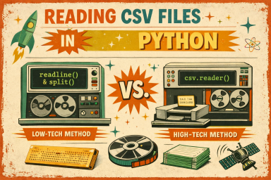

# Reading a CSV File in Python (Two Approaches)

  
This handout shows two ways to read a `.csv` file in Python using the format:

```
name,exam1,exam2,final
```


---

## Approach 1: Using `readline()` and `split()`

### Code

```python
file = open("grades.csv", "r")

line = file.readline()
while line != "":
    parts = line.strip().split(",")

    name = parts[0]
    exam1 = int(parts[1])
    exam2 = int(parts[2])
    final = int(parts[3])

    print(name, exam1, exam2, final)

    line = file.readline()

file.close()
```

### Key Ideas

* `readline()` reads one line at a time
* `strip()` removes the newline character
* `split(",")` breaks the line into a list
* Must manually convert numbers using `int()`

### Pros / Cons

| Pros                     | Cons                               |
| ------------------------ | ---------------------------------- |
| Simple and transparent   | Error-prone with messy data        |
| Good for learning basics | Does not handle commas inside data |
| No imports needed        | More manual work                   |
| Approach works in any coding language           |

---

## Approach 2: Using the `csv` Module

### Code

```python
import csv

with open("grades.csv", "r") as file:
    reader = csv.reader(file)

    for row in reader:
        name = row[0]
        exam1 = int(row[1])
        exam2 = int(row[2])
        final = int(row[3])

        print(name, exam1, exam2, final)
```

### Key Ideas

* `csv.reader()` automatically splits rows correctly
* Handles edge cases (quotes, commas in data)
* `with open()` automatically closes the file
* Still convert numbers using `int()`

### Pros / Cons

| Pros                         | Cons                             |
| ---------------------------- | -------------------------------- |
| Safer and more robust        | Slightly more abstract (hides what is happening)           |
| Handles real-world CSV files | Requires import                  |
| Cleaner code                 | Less “under the hood” visibility |
|                     | Approach may not be available in all languages |

---

## When to Use Each

* Use **Approach 1**:

  * Understanding fundamentals
  * Very simple, controlled data

* Use **Approach 2**:

  * Real-world applications
  * Any file you did not create yourself

---

## Sample Input File (`grades.csv`)

```
Alice,85,90,88
Bob,78,82,80
Charlie,92,88,91
```

---

## Summary

* Both approaches read line-by-line data
* `split()` = manual control
* `csv.reader()` = safer and preferred for real use

---


