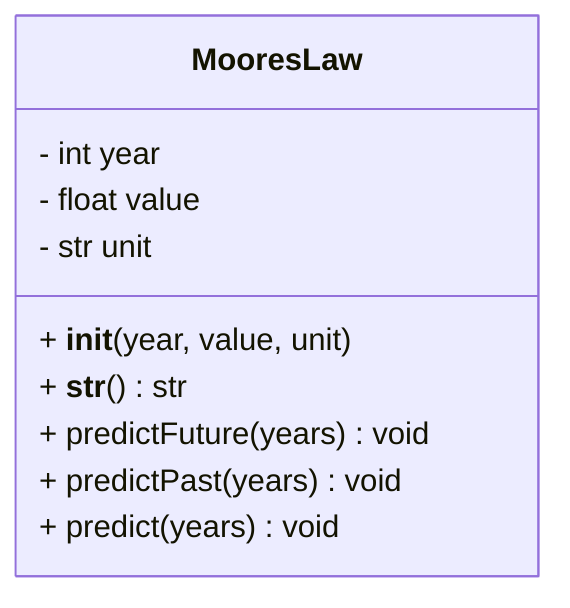

#MooresLaw

```mermaid
classDiagram
    class MooresLaw {
        - int year
        - float value
        - str unit
        + __init__(year, value, unit)
        + __str__() str
        + predictFuture(years) void
        + predictPast(years) void
        + predict(years) void
    }
```
