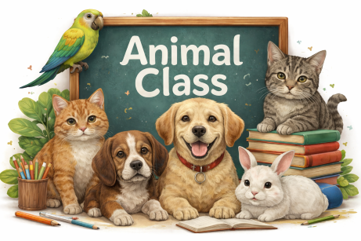
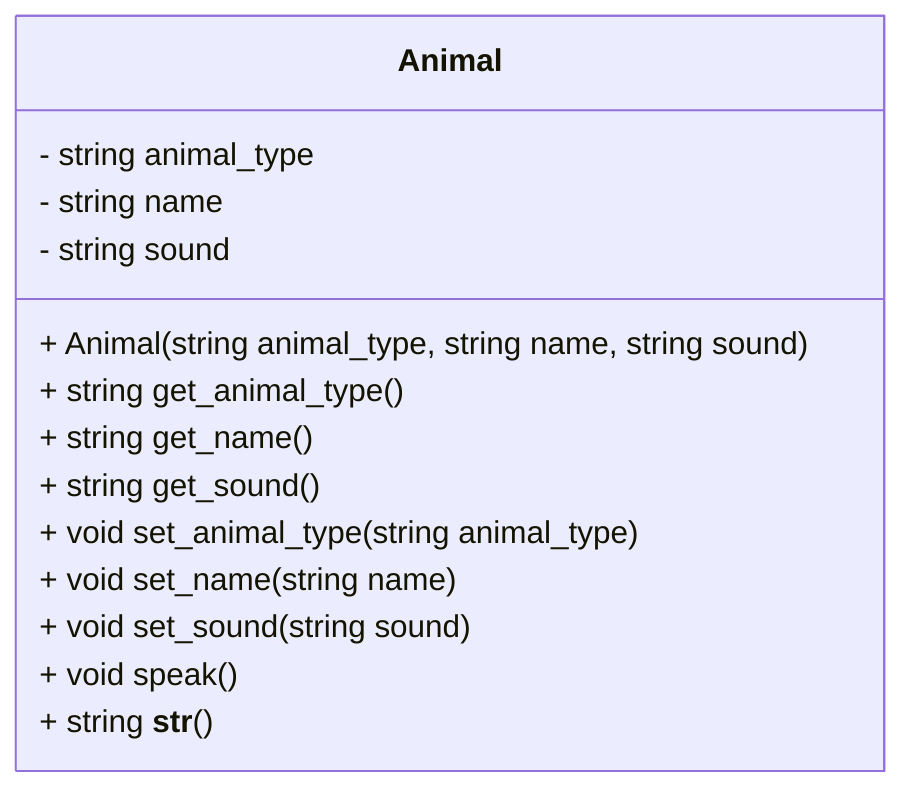

# In-Class Lab: Creating and Using an `Animal` Class



## Objective

In this lab, you will create an `Animal` class with attributes for animal type, name, and sound. The class will include:

* A constructor (`__init__`) to initialize attributes
* Getters and setters for each attribute
* A `__str__` method to display the animal's details
* A `speak` method that prints the sound the animal makes

## Instructions

* Work with your partner to implement the `Animal` class.

## UML Diagram for Animal Class



---

## Step 1: Design the Class and Define the Constructor

### Tasks

a. Create an `Animal` class with the following attributes:

* animal type
* name
* sound

b. Choose appropriate data types for each attribute.

> **Note:** Since `type` is a reserved keyword in Python, use an alternative such as:

* `animal_type`
* `species`

c. Write the constructor (`__init__`) method.

d. The constructor must include each class attribute as a parameter.

e. The constructor must set each class attribute.

f. Add default values for each attribute.

g. Save your code in a file called `Animal.py`.

### Constructor Example

```python
def __init__(self, parameter1=default, parameter2=default, parameter3=default):
    self.attribute1 = parameter1
    self.attribute2 = parameter2
    self.attribute3 = parameter3
```

---

## Step 2: Add Getters and Setters

### Tasks

a. Discuss with your partner:

**Why should we use getters and setters instead of directly accessing attributes?**

### Example Getter and Setter

```python
def get_name(self):
    return self.name

def set_name(self, new_name):
    self.name = new_name
```

---

## Step 3: Add the `__str__` Method

The `__str__` method should return a readable description of the animal.

### Example

```python
def __str__(self):
    return f"{self.attribute1}, {self.attribute2}, {self.attribute3}"
```

---

## Step 4: Add a `speak` Method

Create a `speak` method that prints a sentence in this format:

```text
Maynard the kitten says meow
```

### Example

```python
def speak(self):
    print(f"{self.name} the {self.animal_type} says {self.sound}")
```

---

## Step 5: Create and Test Objects

### a. Add a Main Test Block

Place your test code inside:

```python
if __name__ == "__main__":
```

This allows your class to be tested directly and imported into other files.

---

### b. Create Two Animal Objects Using Default Values

Example:

```python
maynard = Animal()
finn = Animal()
```

---

### c. Call the `speak` Method

Example:

```python
maynard.speak()
finn.speak()
```

---

### d. Print Each Animal Object

Example:

```python
print(maynard)
print(finn)
```

---

### e. Update Attributes Using Setters

Example:

```python
maynard.set_sound("meow")
```

---

### f. Use Getters to Display Attributes

Example:

```python
print(maynard.get_sound())
print(maynard.get_name())
```

---

### g. Create an Animal Object by Passing Values

Example:

```python
maynard = Animal("cat", "Maynard", "meow")
```

---

## Bonus Challenges (If Time Allows)

### 1. Create a List of Animals and Loop Through Them

```python
maynard = Animal("cat", "Maynard", "meow")
finn = Animal("dog", "Finn", "woof")

pets = [maynard, finn]

for pet in pets:
    pet.speak()
```

---

### 2. Update the `speak` Method

Modify the `speak` method so the animal repeats its sound a random number of times (1 to 3).

---

### 3. Add an `age` Attribute

Extend the class to include:

* `age` in the constructor
* getter and setter for age
* update the `__str__` method to display age

---

## Sample Solution 

[`Animal.py`](./Animal.py)

[`Animal_test.py` uses the Animal class](./Animal_test.py)


-- end --

